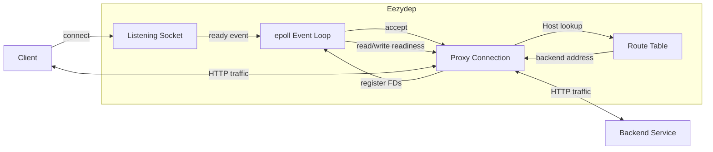
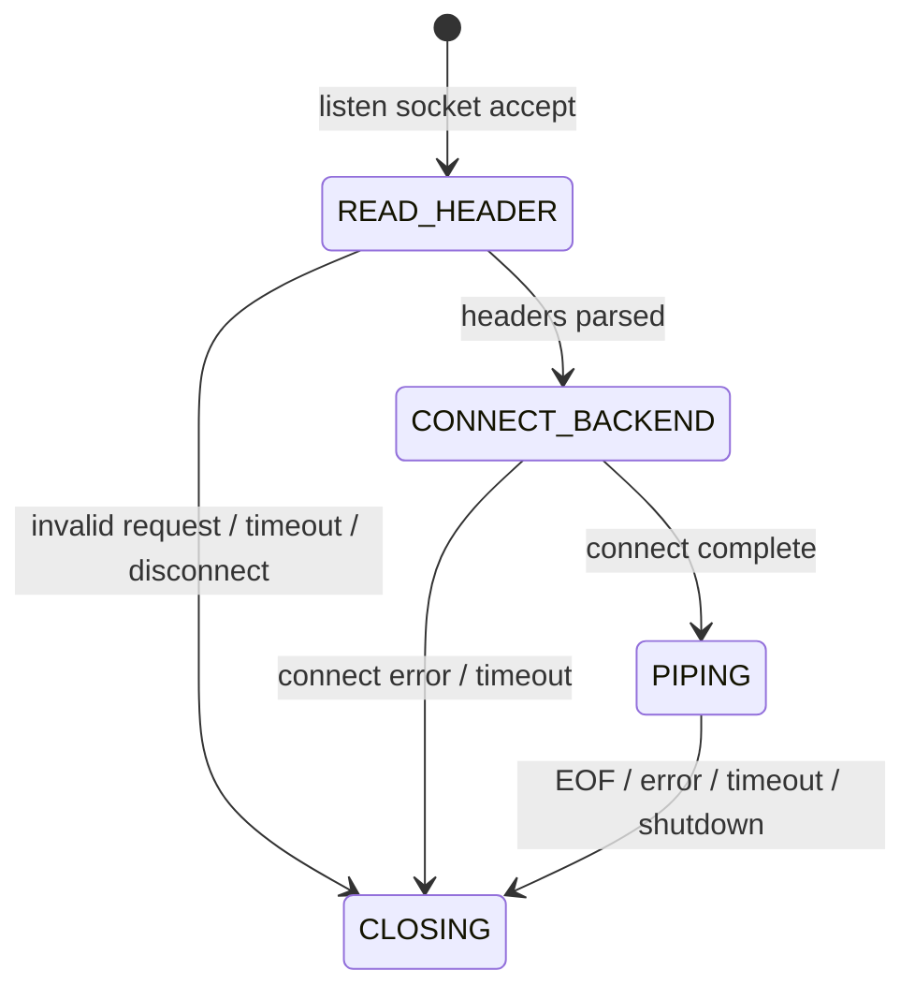

# Eezydep
Eezydep is an event-driven HTTP reverse proxy written in C for Linux systems, built around non-blocking sockets and `epoll`.
It routes incoming HTTP requests to configurable backend services based on the HTTP `Host` header. Each proxied connection is managed through an explicit state machine, with buffered bidirectional I/O, state-specific connection timeouts and non-blocking backend connection establishment.

**Status:** In active development. Eezydep is suitable for development,
experimentation, hackathon projects, and lightweight self-hosted services,
while ongoing work focuses on reliability and production hardening.

## Features
- Event-driven networking using Linux `epoll`
- Configurable backend routes
- Non-blocking client and backend sockets
- Host-based HTTP routing
- Non-blocking backend connection establishment
- Explicit per-connection state machine
- Bidirectional buffered I/O
- Partial read/write handling
- State-specific connection timeouts
- Runtime route reload triggered by `SIGHUP`
- Periodic TCP backend health checks
- Automatic `503 Service Unavailable` responses for unhealthy backends
- Access logging with request, upstream, response status, latency, and byte metadata
- Signal-driven shutdown

## Architecture



A single event loop is run, multiplexing listening, client, and backend
sockets using `epoll`.

Each accepted connection is represented by a `proxy_conn_t` structure that
stores connection state, socket descriptors, timestamps, request data, and
per-direction write buffers.

The state machine determines which operations are valid at each stage of the
connection lifecycle.

## Connection lifecycle

A proxied connection moves through the following states:

### `READ_HEADER`

Eezydep reads HTTP headers from the client until a complete header block is
available. The `Host` header is extracted and the corresponding backend route is retrieved
from the routing table.

### `CONNECT_BACKEND`

A non-blocking connection is initiated to the selected backend. Completion is
detected through `epoll`.

### `PIPING`

Once connected, traffic is forwarded bidirectionally between the client and
backend.

Because socket writes may complete only partially, unsent data is retained in
per-direction buffers and retried when the destination becomes writable.

### `CLOSING`

Socket descriptors are removed from the event loop and all resources associated
with the connection are released.

## Routing Configuration
Routes map HTTP hostnames to backend addresses.

Example:

```text
api.eezydep.org 127.0.0.1:8080
auth.eezydep.org 127.0.0.1:9000
```
A request containing `Host: api.eezydep.org` will be forwarded to `127.0.0.1:8080`

## Current limitations

Eezydep is still being hardened for reliability and security-sensitive
production workloads.

- Linux only, due to reliance on `epoll`
- HTTP/1.x only
- Each hostname currently maps to a single backend
- No load balancing between upstream instances

## Roadmap

Near-term development priorities:

- [ ] Add CLI tooling
- [ ] Complete bounded-buffer backpressure
- [ ] Make backend health checks fully non-blocking
- [ ] Expand integration and stress testing
- [ ] Add TLS termination

Long term, Eezydep is intended to serve as the networking layer of a lightweight
deployment platform for self-hosted applications.
